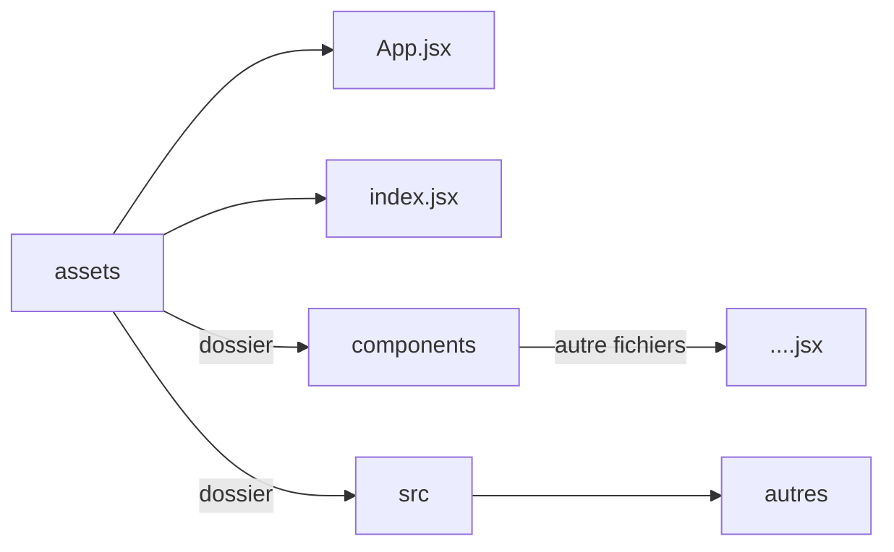

# [Vite](https://vitejs.dev/)


## Créer un dossier avec vite:


1.  

   ```
   npm create vite@latest
   ```

   *créer le dossier* avec la [dernière version](https://www.npmjs.com/package/vite)

   

2. suivre indication dans console


## Structure:

> **package.json**

```js
{
  "name": "tryingtounderstand",
  "private": true,
  "version": "0.0.0",
  "type": "module",
  "scripts": {
    "dev": "vite",
    "build": "vite build",
    "lint": "eslint . --ext js,jsx --report-unused-disable-directives --max-warnings 0",
    "preview": "vite preview"
  },
  "dependencies": {
    // montre les dépendencies et leurs versions
  },
  "devDependencies": {
    "@types/react": "^18.2.15",
    "@types/react-dom": "^18.2.7",
    "@vitejs/plugin-react": "^4.0.3",
    "autoprefixer": "^10.4.14",
    "eslint": "^8.45.0",
    "eslint-plugin-react": "^7.32.2",
    "eslint-plugin-react-hooks": "^4.6.0",
    "eslint-plugin-react-refresh": "^0.4.3",
    "postcss": "^8.4.27",
    "tailwindcss": "^3.3.3",
    "vite": "^4.4.5"
  }
}
```


#### Comment structurer une page:



